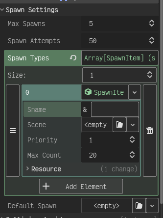
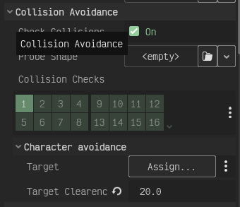
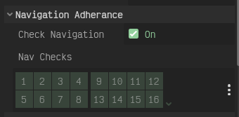
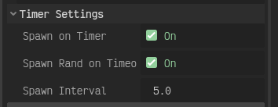

# Spawner
The spawner makes use of the [PointSampler](../README.md) to generate a collection of points that it can scan and spawn the different [SpawnItem]() provided. Using the spawner 
you can configure it to care about the following things when attempting to spawn:

- Collision Layers
- Naviagation Layers
- Player Avoidance

The spawner is highly configurable in the editor and if that is not enough you can extend the script but make sure you mark it with `@tool`so that all the child nodes will be updated in editor for 
that in editor feedback.

## Table of contents

1. [How To](#how-to)
2. [SpawnItem](#spawnitem)
3. [Spawner Settings](#spawner-settings)
4. [Refrences](#refrences)

## How To
Follow these steps to set up a simple spawner in your scene. 

1. Instantiate a new Spawner Scene into your scene tree
2. Click on the Spawner and make sure the following are set.
   - spawn types: list of [spawn items](#spawnitem)
   - default spawn: the fallback incase something goes wrong with the list.
3. In the Timer settings enable the following:
   - spawn on timer = true
   - spawn rand on timeout = true
4. chose a differnt spawn interval if desired.
   
Since each of the settings section in the editor for the spawner are made to be turned on and off setting up just a simple spawner is very straight foward. But with this
set up the spawner will not avoid any walls or the player and could eaisly spawn enemies or object where they can not be reached or directly on top of the player.

## SpawnItem

this is a simple resource type that simply holds the scene to spawn and some meta data the spawner can use when spawning it.
it holds the following data:

- sname: the name to refer to the scene with.
- scene: the scene that will be spawned
- priority: How much should the spawner prioritize spawning this scene. (higher is more often)
- max count: The amount of this scene any single spawner can spawn.

To set up a spawn item provide a scene and a name, after that you have a working scene. if the priority of all the SpawnItem in spawn_types are equal the spawner will not
play favoriates about what to pick. In addition setting the max count to some arbitarly large number that is greater then the spawners max spawns is effictivly the same as having
no spawn cap on the SpawnItem.

## Spawner Settings
the different settings you can modify with the spawner. By modifying these settings the spawner can avoid collisions, enforce spawns are on given navigation layer and are a
minimum distance away from the target.

### Spawn Settigns

- max spawns: the maximum number of things this spawner can spawn.
- spawn attempts: The amount of times per spwan request it tries to find a valid spawn point
- spawn types: A list of SpawnItem's that the spawner can spawn.
- default spawn: A backup spawn in case some error happens this spawn will be the one the spawner attempts to spawn.

### Collision Settings

- check_collisions: Should the spawner respect (avoid) collision layers, if true yes (default).
- probe shape: A Shape2D that is defined to allow control over the search area for collisions
- collision_checks: The collision layers this spawner avoid. If any of these layers overlap a point do not spawn a scene there
- target: The character that the spawner should not spawn things ontop of. (aka. the player)
- target clearance: The distance away from the target that is off limits.

### Navigation Settings

- check navigation: if true the spawner will only spawn things on points that are on the given navigation layers.
- nav checks: the naviagtion layers that should be checked when attempting to spawn.

### Timer Settings

- spawn on timer: if true the spawner will run on a timer calling spawn on timeout.
- spawn rand on timeout: if true the spawner will pick a random SpawnItem to spawn.
- spawn interval: the time between the spawns occur.

  

## Refrences

This node makes use of the PointSpawner to generate the spawn points and as such any question about these settings or how this work consult the [book of PointSampler](../README.md) 

