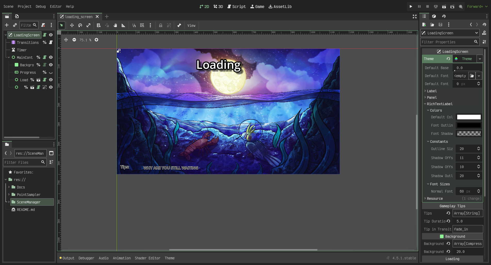
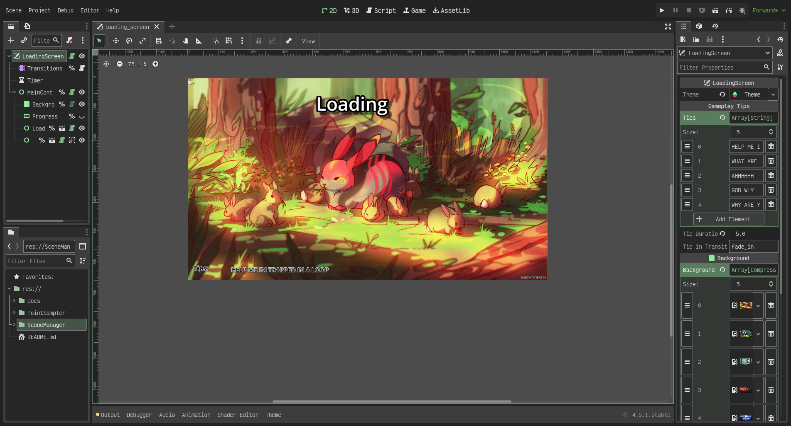

# SceneManager
SceneManager is a tool that allows you to loadscenes and hode the loading behind a fully customizable loading screen, from custom themes to gameplay tips and background slideshows. All of that and more is included in this Tool. This is actully one of my more favoriate tools I have made or worked on. It makes it increadbly simple to load up a bunch of images and text that can be displayed while the scene manager loads content in the background. All loading is done with threads and progress is displayed on a progress bar. Note: if the load is realy quick the progress bar will not be displayed.

## Table of Contents
- [Autoloads](#autoload)
- [Loading Screen](#loading-screen)
- [Examples](#examples)
  
## Autoload
The auto load of this tool is a script with a simple API. Simply call the function:
```gdscript
SceneManager.load_new_scene("Path or UID to scene") # default transation FADE_BLK
SceneManager.load_new_scene("Path or UID to scene", SceneTransitions.Transition.SLIDE_LEFT) # Changes the transition
```

There are a few different transition types built in currently
### Transition List
- FADE_BLK
- SLIDE_RIGHT
- SLIDE_LEFT


## Loading Screen
The loading screen is a collection of UI nodes and tool scripts to provide an interactive in editor experience. Watch the screen react live while you change the scene or add images and tips.
There are 3 main parts of the loading screen and they are:
- **Background:** Displays images or a black screen
- **Loading Text:** Displays Title like text at the top of the loading screen
- **Gameplay Tips:** Displays random gameplay tips at the bottom of the screen
  
### Examples
#### Theme Customization

#### Image and Tip Customization

