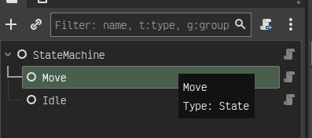

# State Machine

This is a node based state machine that is to say the state machine is a node that has child nodes "states" and it manages which one runs. It is a very straight foward implementation
and is quite extensiable for most cases. Since the state machines initalization function can be extened to take any number of arguments you can pretty much pass the context you need to the state
machine and then on start up or even in the `init` function pass that data to all of the children (states)




## States
Each state is a node an must be the child of a State machine. Each states script can be extended to add the tansitions you desire. By seperating states in to node we can help keep the core logic
of each state clean and seperate. for exaple a simple state might be something like.
### Idle State
```gdscript
@export var move_state: State

func enter() -> void:
	super()
	parent.velocity = Vector2.ZERO


func process_input(_event: InputEvent):
	if move_cmpt.wants_move():
		return move_state
	return null
```

### Move State
```gdscript
@export var idle_state: State

func enter() -> void:
	super()


func process_physics(_delta: float):
	var movement = Vector2.ZERO
	movement = move_cmpt.get_move_direction()
		
	if movement == Vector2.ZERO:
		return idle_state
	
	animations.flip_sprite(movement.x < 0)
	parent.velocity = movement * move_cmpt.move_stats.speed
	parent.move_and_slide()
	return null

```

### Dependencies

Now While those states were clean it is importat to note that the both states are using the AnimationComponent and the MoveComponent under the hood. there for you need to either remove the code 
that refrences these and implement you own or implement code following the interfaces for those components. I know what you are all thinking GDScript doesnt have interfaces, I know this we all 
know this these are simple me abusing the `@abstract` syntax and calling it an interface.

1. AnimationComponent
2. MovementComponent
3. AudioComponent

These are the main ones as most likely you will want each state to have its own animation, audio, and movement.

